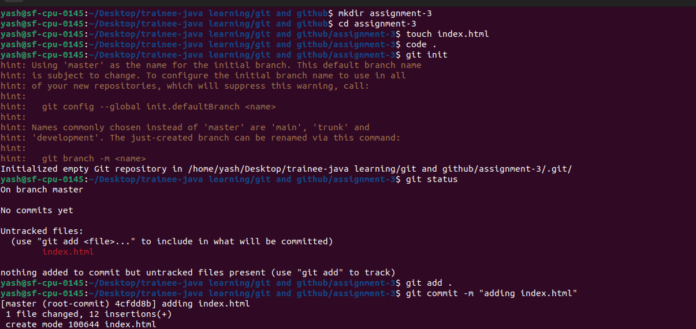
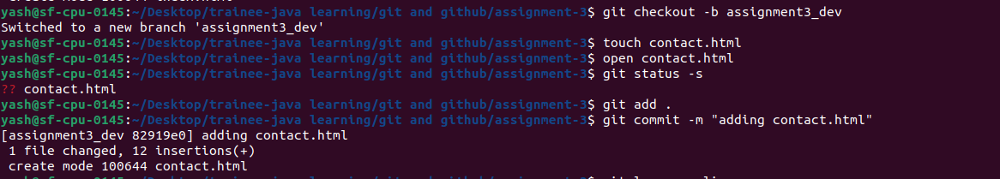
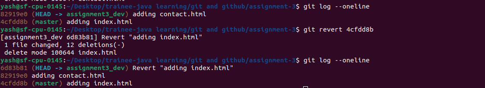

# GIT Assignments

## Assignment - 3

Problem Definition

- Create a branch from the master branch and make changes and commit changes 

Step - 1 : Created index.html and commit

Step - 2 : creating assignment3_dev branch and commit changes

- Revert recently committed code
-- Before and After log of commits

## END